# React项目调试完整指南

> 📚 这是一份完整的React项目调试指南，涵盖了从环境设置到生产部署的所有调试技术和最佳实践。

## 📋 目录

- [环境设置与检查](#环境设置与检查)
- [开发工具配置](#开发工具配置)
- [调试脚本使用](#调试脚本使用)
- [运行时调试](#运行时调试)
- [测试与验证](#测试与验证)
- [性能优化](#性能优化)
- [常见问题解决](#常见问题解决)
- [最佳实践](#最佳实践)

## 🔧 环境设置与检查

### 系统要求

- **Node.js**: >= 16.0.0 (推荐 18.x 或更高版本)
- **npm**: >= 8.0.0 或 **yarn**: >= 1.22.0
- **Git**: 用于版本控制

### 环境检查命令

```bash
# 检查Node.js版本
node --version

# 检查npm版本  
npm --version

# 检查项目依赖状态
npm ls --depth=0

# 运行项目环境诊断
npm run debug:analyze
```

### 依赖安装与验证

```bash
# 安装项目依赖
npm install

# 检查依赖完整性
npm audit

# 修复安全漏洞
npm audit fix

# 检查过时的包
npm outdated
```

## 🛠️ 开发工具配置

### VS Code配置

推荐安装以下扩展：

```json
{
  "recommendations": [
    "esbenp.prettier-vscode",
    "dbaeumer.vscode-eslint",
    "bradlc.vscode-tailwindcss",
    "ms-vscode.vscode-typescript-next",
    "formulahendry.auto-rename-tag",
    "christian-kohler.path-intellisense"
  ]
}
```

### ESLint配置

项目已配置ESLint，运行以下命令：

```bash
# 检查代码规范
npm run lint

# 自动修复可修复的问题
npm run lint:fix
```

### Prettier配置

代码格式化：

```bash
# 格式化代码
npm run format

# 检查格式是否正确
npm run format:check
```

## 🔍 调试脚本使用

### 快速诊断脚本

```bash
# 运行Shell脚本进行全面检查
bash debug-analyzer.sh

# 或者使用npm命令
npm run debug:analyze
```

### 代码质量分析

```bash
# 运行代码分析器
npm run debug:code

# 生成详细报告
node code-analyzer.js
```

### 包管理器调试

```bash
# 检查依赖问题
npm run debug:package

# 运行完整调试流程
npm run debug:all
```

## 🐛 运行时调试

### 使用内置调试器

项目集成了运行时调试工具，在开发环境中：

```javascript
// 在组件中使用
import ReactDebugger from '../utils/debugger'

// 记录状态变化
window.reactDebugger.trackStateChange('ComponentName', oldState, newState)

// 记录错误
window.reactDebugger.logError(error, errorInfo)
```

### 快捷键

- **Ctrl+Shift+D**: 显示调试面板
- **F12**: 打开浏览器开发者工具

### 错误边界

项目包含错误边界组件：

```jsx
import ErrorBoundary from './components/ErrorBoundary'

function App() {
  return (
    <ErrorBoundary showDetails={process.env.NODE_ENV === 'development'}>
      <YourComponent />
    </ErrorBoundary>
  )
}
```

## 🧪 测试与验证

### 运行测试

```bash
# 运行所有测试
npm test

# 运行测试并生成覆盖率报告
npm run test:coverage

# 运行测试UI界面
npm run test:ui

# 运行单次测试
npm run test:run
```

### 测试文件结构

```
src/
├── components/
│   └── ComponentName/
│       ├── ComponentName.jsx
│       └── __tests__/
│           └── ComponentName.test.jsx
└── test/
    ├── setup.js          # 测试环境设置
    └── test-utils.jsx    # 测试工具函数
```

### 编写测试

```javascript
import { describe, it, expect } from 'vitest'
import { render, screen } from '../test/test-utils'
import Component from './Component'

describe('Component', () => {
  it('should render correctly', () => {
    render(<Component />)
    expect(screen.getByText('Expected Text')).toBeInTheDocument()
  })
})
```

## ⚡ 性能优化

### 性能监控

使用内置的性能监控工具：

```javascript
// 查看性能分析
const analysis = window.reactDebugger.analyzePerformance()
console.log(analysis)

// 导出性能数据
window.reactDebugger.exportDebugData()
```

### 常见性能问题

1. **组件重渲染过多**
   ```javascript
   // 使用React.memo优化
   const Component = React.memo(({ props }) => {
     return <div>{props.text}</div>
   })
   ```

2. **状态更新过于频繁**
   ```javascript
   // 使用useCallback和useMemo
   const memoizedCallback = useCallback(() => {
     doSomething(a, b)
   }, [a, b])
   ```

### 构建优化

```bash
# 分析构建产物
npm run build

# 预览构建结果
npm run preview
```

## ❓ 常见问题解决

### 问题分类

| 问题类型 | 症状 | 解决方案 |
|---------|------|---------|
| 导入错误 | `Module not found` | 检查文件路径和扩展名 |
| 类型错误 | TypeScript报错 | 运行`npm run type-check` |
| 构建失败 | Build错误 | 检查依赖和配置文件 |
| 运行时错误 | 白屏或错误边界 | 查看控制台和错误日志 |

### 常见错误修复

#### 1. 模块解析问题

```bash
# 清理缓存并重新安装
rm -rf node_modules package-lock.json
npm install
```

#### 2. 端口占用

```bash
# 查找占用端口的进程
lsof -ti:3000

# 杀死进程
kill -9 <PID>
```

#### 3. 内存不足

```bash
# 增加Node.js内存限制
export NODE_OPTIONS="--max-old-space-size=4096"
npm run build
```

### 调试步骤

1. **确认环境**：运行`npm run debug:analyze`
2. **检查依赖**：运行`npm run debug:package`
3. **代码检查**：运行`npm run lint`
4. **类型检查**：运行`npm run type-check`
5. **运行测试**：运行`npm test`
6. **构建测试**：运行`npm run build`

## 🎯 最佳实践

### 开发流程

```mermaid
graph LR
    A[编写代码] --> B[运行检查]
    B --> C[修复问题]
    C --> D[运行测试]
    D --> E[提交代码]
    E --> F[CI/CD检查]
```



### 代码质量检查清单

- [ ] ESLint检查通过
- [ ] Prettier格式化完成
- [ ] TypeScript编译无错误
- [ ] 单元测试覆盖率 > 80%
- [ ] 构建成功
- [ ] 性能指标正常

### 调试技巧

1. **使用console.group**分组日志
   ```javascript
   console.group('用户操作')
   console.log('点击按钮')
   console.log('发送请求')
   console.groupEnd()
   ```

2. **使用React DevTools**
   - 安装React DevTools浏览器扩展
   - 检查组件树和props/state

3. **使用Source Maps**
   - 开发环境默认启用
   - 便于定位源代码错误

4. **网络请求调试**
   ```javascript
   // 在开发环境添加请求拦截
   if (process.env.NODE_ENV === 'development') {
     // 添加请求日志
   }
   ```

### 错误处理策略

1. **Error Boundary**：捕获组件错误
2. **Try-Catch**：处理异步操作
3. **验证输入**：防止无效数据
4. **优雅降级**：提供备用方案

## 🔗 有用的资源

- [React官方文档](https://react.dev/)
- [Vite文档](https://vitejs.dev/)
- [Vitest文档](https://vitest.dev/)
- [ESLint规则](https://eslint.org/docs/rules/)
- [Prettier配置](https://prettier.io/docs/en/configuration.html)

## 📞 获取帮助

如果遇到无法解决的问题：

1. 查看项目生成的调试报告
2. 检查浏览器开发者工具控制台
3. 查看项目的GitHub Issues
4. 搜索Stack Overflow相关问题

---

*本指南会持续更新，建议收藏并定期查看最新版本。*